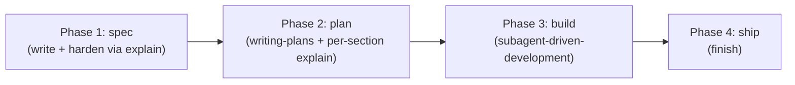
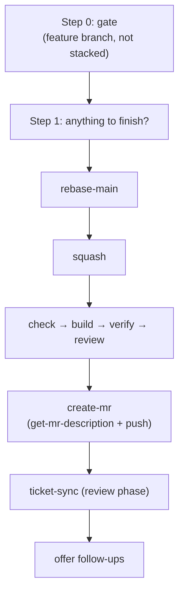

# Workflow Skills (Plan, Implement, Finish, Integrate)

# Workflow Skills: Plan → Implement → Finish → Integrate

These are omc's session-side skills for taking work from an idea to a pushed, described branch — plus the meta-skill that sets up a project to support the other three. They compose rather than duplicate: each one calls the next as a black box and reacts only to its terminal verdict.

## The shape of a composed flow

Every multi-step skill here follows the same discipline, stated explicitly in each `SKILL.md`:

- **Externalize the flow into the task list as the first action.** These flows nest deeply (`implement → spec → explain`, `implement → finish → create-mr → get-mr-description`) and each phase produces a large, polished artifact — a spec, a plan, an MR description. The artifact *looks* like a finish line, which is exactly the failure mode: the session treats it as one and stops. The task list is what survives the illusion.
- **Phase transitions are not gates.** Nothing pauses between phases for permission — the user invoking the top-level skill already granted it. The only legitimate stops are CRITICAL findings or a genuine blocker (failed stage, rejected push, rebase conflict).
- **A verdict line is an argument to the next step, not an end of turn.** `OMC_SQUASH {...}`, `OMC_STAGE {...}`, `OMC_TICKET {...}` are machine-readable outcomes; whatever they say, the immediate next action is a tool call, not a stop.

## `plan` — brainstorm setup

Wraps `superpowers:brainstorming` with one project-grounding pass first.

1. Composes exactly one question for `/omc:explain` ("Which parts of this codebase are relevant to: `<goal>`?") and folds the answer into a primer, along with pointers to `docs/superpowers/specs/`, `docs/superpowers/plans/`, and `.omc/docs/gitnexus/docs/`.
2. Every explain outcome is non-fatal — a missing index or a failure just gets recorded as a line in the primer rather than blocking anything.
3. Asks the user for their seed *after* showing the primer, so their thinking reacts to what the codebase already says.
4. Hands off to `superpowers:brainstorming` with the seed, the primer, the model-tier pointer for any resulting plan, and (when `OMC_SLUG` is set) the doc-naming convention for the spec/plan files.

`plan` never designs or writes code itself — it's pure setup, and it's the skill `/omc:start` invokes after ticket-context gathering.

## `implement` — the conductor

The top-level lifecycle skill, typed mid-brainstorm once a design has converged. Four phases, always in this order:



- **Phase 1 (spec)** invokes the internal `spec` skill, which writes the design doc and hardens it section-by-section (and then as a whole) via repeated `/omc:explain` calls until explain stops surfacing real issues. Only a CRITICAL finding — one that invalidates part of the converged design — stops the flow for user input; everything else gets folded in and reported afterward.
- **Phase 2 (plan)** invokes `superpowers:writing-plans`, then pressure-tests each major section with its own `/omc:explain` call (implementation-level: enums, parameters, reuse — not architecture, which was `spec`'s job). It passes `writing-plans` a directive to stamp every task with a `Model:` tier line per the model-tier policy.
- **Phase 3 (build)** runs `superpowers:subagent-driven-development` — one fresh subagent per task, each dispatched at its tier's resolved model. After each task's subagent and reviews complete, `/omc:check` runs as a fast gate before the next task; a failing check blocks progression. Full `/omc:verify` is deliberately excluded from this per-task loop — it's `finish`'s job, reserved for milestones.
- **Phase 4 (ship)** invokes `finish`.

`implement`'s completion contract is inherited from `finish`'s: it isn't done until `finish` is done.

## `finish` — rebase, squash, gate, push

The workhorse that turns a feature branch into a pushed, described commit. Composes six sub-skills in strict sequence:



- **Gate**: must be on a feature branch (not detached, not base), and not stacked on another unmerged branch.
- **`rebase-main`**: rebases onto `origin/<base>` and re-mirrors `.gitnexus`/`.omc/docs` from the primary checkout. An `rc 3` (conflicts) hands control straight to the user — `finish` never resolves conflicts or aborts on their behalf.
- **`squash`**: folds any uncommitted changes (`git add -A`), then `git reset --soft origin/<base>` plus one commit carrying a temporary `wip: squash of <branch>` message. Reports `OMC_SQUASH {"ok": ..., "commits_folded": N}`; `ok: false` stops the flow.
- **Project stages, in order — `check` → `build` → `verify` → `review`**: each is a thin proxy (see below) around `.omc/skills/<stage>/SKILL.md`. `check` runs first as the cheap fail-fast gate. Any stage that modifies tracked files (formatters/autofixers) gets amended into the squashed commit; any stage reporting `"passed": false` stops the entire flow before push — the branch stays squashed for the user to fix and re-run `finish`.
- **`create-mr`**: calls `get-mr-description` for the title+body, amends it into the squashed commit (so the commit message *is* the MR description — no forge API is ever called to open an MR), then `git push --force-with-lease` (or plain push on a brand-new branch). A rejected push surfaces the error and stops; never blindly retried or forced.
- **`ticket-sync`** (review phase): moves the ticket to review status by branch-derived key. Failure here doesn't block anything — the push already succeeded — it's just reported and the flow continues.
- **Follow-ups**: reports what happened, then always offers exactly three options — close the worktree (`wt remove` from the primary checkout), address review comments (amend + re-run `create-mr`, skipping `ticket-sync` since the ticket's already in review), or just chat.

`finish`'s completion contract is explicit: pushed with a real description, ticket-sync attempted, and follow-ups offered — a branch left on a `wip:` message or silently un-synced is a failed run.

### The project-stage proxies: `check` / `build` / `verify` / `review`

`build`, `verify`, and `review` (and `check`, called directly by `implement`'s per-task loop) share one pattern: resolve the project root, look for `.omc/skills/<stage>/SKILL.md`, and if absent, report `"configured": false, "passed": true` — an unconfigured stage is a pass, never a failure. If present, they defer entirely to the project's own instructions and end with one machine-readable line:

```
OMC_STAGE {"stage": "<name>", "configured": true|false, "passed": true|false, "summary": "..."}
```

omc supplies no opinion on *what* build/verify/review mean for a given project — that's `integrate`'s job to establish once, up front.

### `get-mr-description`

Internal to `create-mr`. Reads `git log`/`git diff --stat` (plus the diff itself) over the given base/extent and returns a title (≤72 chars, becomes the commit subject) and a markdown body — scaled to the size of the diff, never inventing tests or claims the diff doesn't support.

## `integrate` — establishing the project stages

Where `finish` and `implement` *consume* `.omc/skills/{check,build,verify,review,...}`, `integrate` is how those files get created or kept honest. It's a guided, interactive setup/audit flow, not a headless mutator — in non-interactive runs it proposes and writes nothing.

- **Fresh mode** (no `.omc/` surfaces): guided first-time setup.
- **Review mode** (surfaces exist): evaluates each against both current project reality and omc's current conventions — drift happens (e.g. a `build` skill still invoking `make test` after the project migrated to a justfile), and review mode is built to catch it.

It inventories every omc surface (root `AGENTS.md`/`CLAUDE.md` chain, `.config/wt.toml`, `.gitnexus/`, and the `check`/`build`/`verify`/`review`/`explain-context`/`investigation-context` skill slots), applies mechanical fixes via existing machinery (`omc configure`, `check-wt-config`), then goes slot-by-slot proposing content grounded in the actual codebase (justfile/Makefile/CI targets, the knowledge graph) — writing only on explicit approval. One migration case is called out specifically: a project with `build` but no `check` predates the check/build split (check = minimal build + unit tests, build = the whole world with no tests), and `integrate` proposes splitting it.

## How the tests exercise this

`tests/e2e/test_e2e_finish.py` and `tests/e2e/test_e2e_integrate.py` run these skills against live Claude sessions inside containers, with a local bare repo standing in for the forge (`make_work_repo`/`_make_feature_branch` in `harness.py` set up the fixture; `judge` in `judge.py` scores the transcript against a rubric):

- `test_finish_squashes_describes_and_pushes` — asserts the squash lands as exactly one non-`wip` commit with a description body, and the judge confirms no `gh`/`glab` call ever fires (the no-forge-API contract).
- `test_finish_runs_passing_check_and_build_stages_then_pushes` — seeds project `check`/`build` stages that drop `/tmp` marker files in order, confirming both proxies actually ran (and in the right order) before the push lands.
- `test_finish_stops_before_push_on_failing_stage` / `..._check_stage` — seeds a failing `build`/`check` stage and asserts the branch never reaches origin, verifying the "stop before push" contract from `finish` Step 4.
- `test_fresh_integrate_proposes_grounded_drafts_and_writes_nothing` — headless `integrate` on a justfile+pytest project must propose drafts citing the *real* commands (not generic npm/make boilerplate) and leave the working tree clean.
- `test_review_integrate_flags_drifted_build_stage` — seeds a stale `build` skill (`make test` with no Makefile present) and confirms review mode flags the drift and proposes a fix without silently rewriting the file.