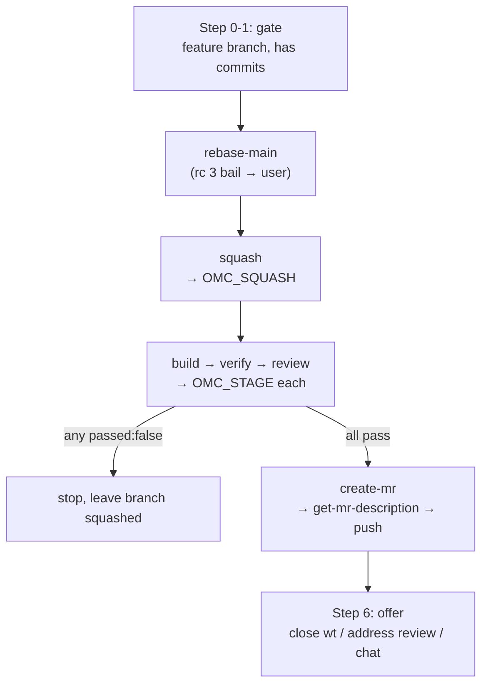

# Workflow Skills

# Workflow Skills

The `skills/` directory is the session-side half of oh-my-clanker: a set of prompt-driven skills that a coding harness (Claude Code, Codex, OpenCode) loads and follows. They are the counterparts to the `omc` Python CLI — the CLI does what only a shell can do (name sessions, set tab titles, create worktrees), and these skills do what only an in-session agent can do (read tickets, reason about a diff, run the project's own stages, hand off to design tools).

Each skill is a `SKILL.md` file with YAML frontmatter (`name`, `description`) and a markdown body of instructions. There is no executable code here — the "call graph" is the set of `Invoke the <name> skill` directives inside the prose. That is why the graph-analysis tooling reports no edges: the wiring lives in natural language, and the harness resolves each named skill as `/omc:<name>`.

## Two lifecycles

The skills split cleanly into a **development lifecycle** (start a ticket → finish a branch) and a **knowledge lifecycle** (index → document → explain a codebase).

| Skill | Kind | Role |
|---|---|---|
| `start` | user-facing | Gather ticket context, verify base is fresh, hand off to brainstorming |
| `slug` | headless + user-facing | Turn a ticket/description into a branch slug |
| `finish` | user-facing | Orchestrate rebase → squash → stages → push |
| `squash` | internal | Collapse the branch to one commit over `origin/<base>` |
| `create-mr` | internal | Amend the MR description into the commit and push |
| `get-mr-description` | internal | Produce the MR/PR description text from a diff |
| `build` / `verify` / `review` | project-stage proxies | Run the project's own stage if it defines one |
| `index` / `document` | user-facing | Refresh the GitNexus graph / wiki |
| `explain` | user-facing | Answer "how does X work" from graph + project context |

Skills whose descriptions carry *"Internal — … not meant for direct invocation"* are contracts between other skills, not entry points for the user. This is a machine-checkable convention (see the invariants in `CLAUDE.md`).

## The development lifecycle

### `start` — prepare and hand off

`start` is the session-side half of the `omc start` shell command. Its first job is to figure out **which path it is on** by reading `OMC_SLUG` and the current branch:

- **Prepared path** — `OMC_SLUG` is set and the branch ends with it, meaning the CLI created this worktree and seeded the session. Continue.
- **Cold path** — anything else. The skill stops and redirects the user to `omc start <ticket>`, because naming the session and creating the worktree are things a skill cannot do from inside a session.

From there it verifies the `superpowers` plugin is present, gathers context (fetching a ticket via whatever read tool the session has, never writing back to the tracker), and enforces a **base-freshness gate**: fetch `origin/<base>`, and if HEAD is not a descendant, rebase — never brainstorm on a stale base, never force through conflicts. Finally it hands off to `superpowers:brainstorming` with a doc-naming directive that pins the design and plan docs to the `$OMC_SLUG` topic slug. `start` deliberately never designs or writes code itself.

### `slug` — name the work

`slug` classifies its input as a ticket key, a ticket URL, or free text, resolves a key/URL read-only through a configured tool, and derives a branch slug (`[a-z0-9-]`, ≤6 words / 50 chars, ticket key baked in). It is used **headlessly** by the `omc start` CLI and is also directly invocable.

Its defining feature is a strict machine-readable verdict as the **last line, exactly one, no backticks**:

```
OMC_SLUG {"ok": true, "slug": "proj-123-fix-login-timeout"}
OMC_SLUG {"ok": false, "reason": "mcp-missing" | "mcp-unauthenticated" | "ticket-not-found" | "context-insufficient", "message": "<one actionable sentence>"}
```

The four failure reasons are distinct on purpose — each maps to a different remedy (configure a tool, re-authenticate, create the ticket, add context) that the `message` must spell out.

### `finish` — the orchestrator

`finish` is the most composite skill: it chains the internal skills and the project-stage proxies into one pipeline, gating at each step.



Key behaviors that a contributor must preserve:

- **Gates before work.** It refuses on a detached HEAD or the base branch, refuses stacked branches (checks `git branch --contains` on the earliest own commit), and stops early if there is nothing to finish.
- **Never resolves conflicts on the user's behalf.** On the `rebase-main` skill's **rc 3 bail**, it hands control back — no silent `--abort`, no silent resolution.
- **Stage semantics.** Each of `build`/`verify`/`review` runs in order. A stage that autofixed *tracked* files gets amended into the squashed commit; a stage that *failed* stops the pipeline at that point (remaining stages do not run, nothing is pushed) so the user can fix and re-run.
- **It does not create the MR/PR.** `create-mr` pushes; the human opens the actual MR from the forge.

### `squash` → `create-mr` → `get-mr-description`

These three internal skills implement the tail of `finish` and share tight preconditions.

`squash` assumes the branch is already rebased, folds any uncommitted changes (with notice), does `git reset --soft origin/<base>`, and produces exactly one commit with a *temporary* message. It ends with an `OMC_SQUASH {"ok": …}` line.

`create-mr` takes that single squashed commit, calls `get-mr-description` to generate the real message, `git commit --amend`s it in, and pushes with `--force-with-lease` (force because history was rewritten; the lease guards a teammate's push). A rejected push is surfaced, never retried blindly and never `--force`d. It then prints a forge-specific "open the MR" URL derived from `remote.origin.url`, with credentials redacted. Crucially it **never calls `gh`, `glab`, or any forge API** — the commit carries the description, and the human creates the MR.

`get-mr-description` reads the actual diff (`git log`, `--stat`, and the diff itself) for a base + extent scope and returns *only* the description text: an imperative title ≤72 chars on line 1 (which doubles as the squashed commit subject and MR title), a blank line, then a markdown body. It scales detail to the diff and never invents tests or claims.

## Project-stage proxies: `build`, `verify`, `review`

These three are structurally identical proxies. oh-my-clanker has nothing of its own to do at these steps — instead each resolves the project root (`git rev-parse --show-toplevel`), looks for `<root>/.omc/skills/<stage>/SKILL.md`, and:

- **Missing** → reports "no project `<stage>` stage configured" and treats it as a **PASS**.
- **Present** → reads and follows the project's own skill, running from the project root.

Every proxy always ends with one machine-readable line consumed by `finish`:

```
OMC_STAGE {"stage": "verify", "configured": true|false, "passed": true|false, "summary": "<one sentence>"}
```

This is the extension point that lets any repo define what "build", "verify", and "review" mean for itself (this repo's own stages live under `.omc/skills/{build,verify,review}`).

## The knowledge lifecycle: `index`, `document`, `explain`

These skills front the GitNexus knowledge graph. `index` and `document` are thin delegators: `index` calls the internal `gitnexus-index` skill and relays its report, `document` calls `gitnexus-document`. Both are meant to run in the **main checkout** as the base branch moves — worktrees all read the primary root's graph, so refreshing there keeps `explain` current everywhere. Indexing is incremental.

`explain` is the read side and composes two sources:

1. **Project context (optional)** — if `.omc/skills/explain-context/SKILL.md` exists, read and follow it first; it is the project's own guide to where canonical docs and decision records live.
2. **Graph evidence** — invoke the internal `gitnexus-explain` skill, which returns symbol/file citations, flows, and doc excerpts (or the "run `/omc:index` first" guidance, relayed verbatim).

It then synthesizes **one** prose answer, citing evidence as `file:symbol`, explicitly naming where the two sources disagree, and stating what could not be established rather than guessing.

## Conventions a contributor must honor

- **Machine-contract lines** (`OMC_SLUG`, `OMC_STAGE`, `OMC_SQUASH`) are single JSON lines emitted as the *last* line, never wrapped in backticks or a fence. Parsers tolerate markdown wrapping, but skills must not emit it.
- **Internal vs. user-facing** is signaled in the frontmatter `description` — internal skills say so and are only ever reached through another skill.
- **Read-only toward external systems.** `start` and `slug` never write to the tracker; `create-mr` never touches a forge API. The skills produce local artifacts (commits, pushes) and hand outward-facing actions to the human.
- **Never force through failure.** The rebase/conflict/push paths all stop and surface rather than override — consistent with the finish pipeline's fail-stop stage semantics.

These skills pair with the `omc` CLI documented in `CLAUDE.md`; the CLI seeds `OMC_SLUG` and the worktree, and these skills carry the session from ticket to pushed, described commit.